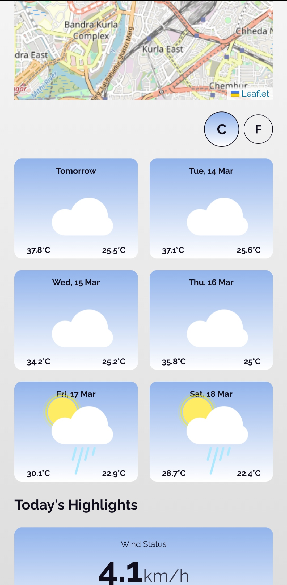

# Weatherly

Weatherly is an advanced real-time weather forecasting app which comes with great features like interactive map and 7-day weather broadcase in advance. This web-app is built in ReactJS and Sass. An app where you can check different weather measures in your locality or anywhere around the world.

For live site view, [Click here](https://sagar969.github.io/weatherly/)

## Table of contents

- [Overview](#overview)
  - [The Product](#the-product)
  - [Screenshots](#screenshots)
    - [Desktop view](#desktop-view)
    - [Mobile view](#mobile-view)
  - [Links](#links)
- [My process](#my-process)
  - [Built with](#built-with)
  - [What I learned](#what-i-learned)
  - [Continued development](#continued-development)
  - [Useful resources](#useful-resources)
- [Author](#author)

## Overview

Weatherly is a real-time weather forecasting app. This app provides houly updated weather details of the places all around the world. You just have to write down the name of place in searchbar or even better mark down the location on map and this app will provide you weather data of that place.
### The Product

In this app users can:

- allow location access to check different weather measures in their city.
- be able to use the app after denying the access to location.
- search for any place around the world.
- See different weather measures - maximum and minimum temperature, weather type, wind speed and direction, humidity, visibility and air pressure.
- check the weather conditions for today and next 6 days.
- switch to light or dark theme.
- See hover and focus states for all interactive elements on the web-app.

### Screenshots

This app is responsive to every screen size out there in market.
Desktop and Mobile view -

#### Desktop View

#### Mobile View

### Links

- Source code URL: [Source Code](https://github.com/Sagar969/weatherly)
- Live Site URL: [Live Site](https://sagar969.github.io/weatherly/)

## My process
This is my first React project. I started with basic react concepts like basic hooks and a lot of prop drilling and with time, I added some advanced features to it and context api to reduce prop drilling.

I used total of three APIs in this project for different purposes. Used react-animations and styled components for animations on mounting and unmounting of components.

### Built with

- [React](https://reactjs.org/) - JS library
- [Sass](https://sass-lang.com/) - CSS with Superpowers
- [Styled Components](https://styled-components.com/) - For animation styling
- [React-animations](https://github.com/FormidableLabs/react-animations) - Animations for react components
- [React Leaflet API](https://react-leaflet.js.org/) - For map
- [Openmeteo API](https://open-meteo.com/) - For Weather data
- [LocationIQ API](https://locationiq.com/) - For GeoCoding

### What I learned

I learned all the react concepts required to build a full fledged app. I learned react hooks, state management, animation in components, context api, Sass styling, API integration and many more things.

### Continued development

I am deep diving into state management in react and learning a state management library called redux after completion of this project.

### Useful resources

- [Stack Overflow](https://stackoverflow.com/) - Stack Overflow has a great community. When I get stuck somewhere and can't resolve the issue myself, I usually ask here for help and get answers in minutes.
- [OpenMeteo API](https://open-meteo.com/), [locationIQ API](https://locationiq.com/) and [React-Leaflet API](https://react-leaflet.js.org/) - The documentations for these APIs are easy and quick to go through that helped me lot in this project.
- [5 ways to animate a react app](https://medium.com/hackernoon/5-ways-to-animate-a-reactjs-app-in-2019-56eb9af6e3bf) - This medium article let me know about different ways to apply animations in react.
- [Deploying react apps to github pages](https://blog.logrocket.com/deploying-react-apps-github-pages/) - This article helped me solving my issues regarding deployment of react app on github pages.s

## Author

- Profile - [Sagar Mavai](https://github.com/Sagar969/)
- LinkedIn - [Sagar Mavai](https://www.linkedin.com/in/sagar-mavai-986b25206)
- Twitter - [@sagarmavai](https://www.twitter.com/sagarmavai)
